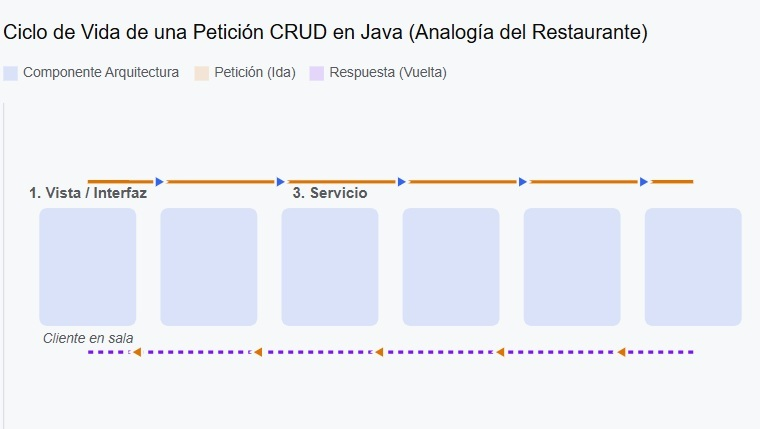
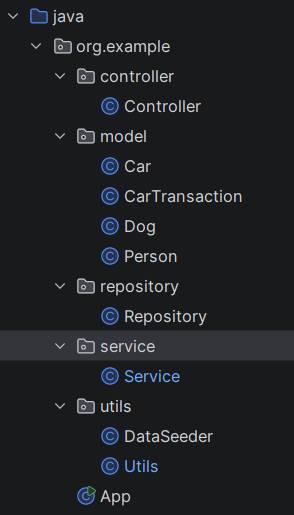
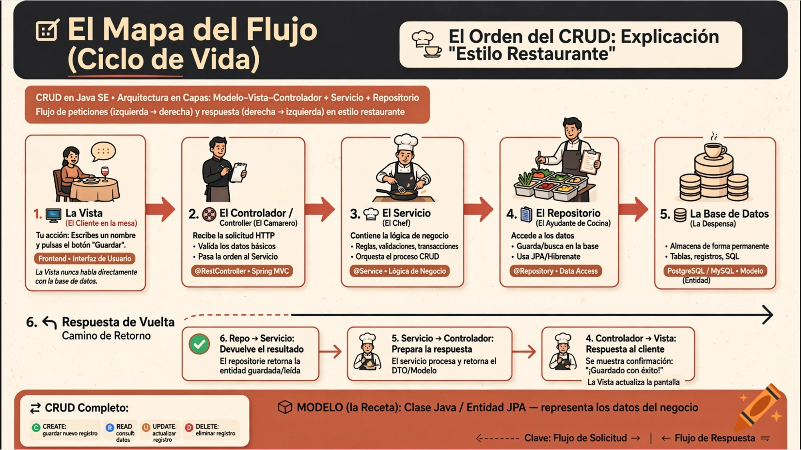
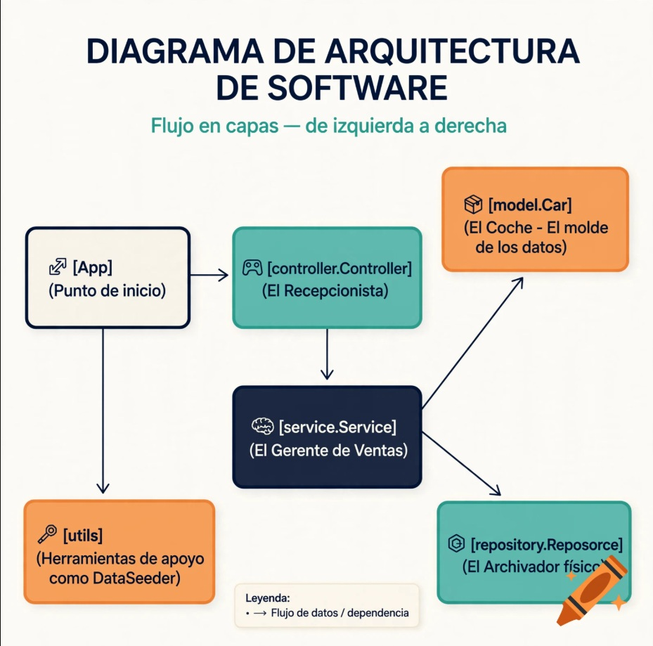
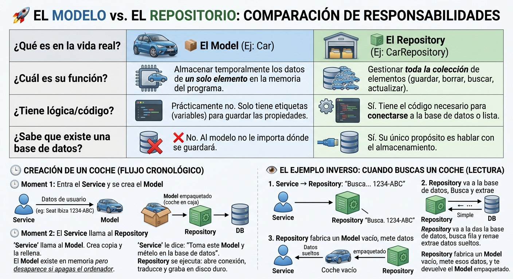

# 🚀 *** Simply CRUD explanation ***



Para ayudarte a verlo clarísimo, he preparado una explicación paso a paso del ciclo de vida de un **CRUD en Java SE** utilizando la arquitectura estándar de capas (Modelo-Vista-Controlador junto con Servicio y Repositorio).

Imagítate que tu aplicación Java es como **un restaurante de alta cocina**. Cada capa tiene un único trabajo y se comunican en un orden estricto de ida y vuelta.

----------

🗺️ El Mapa del Flujo (Ciclo de Vida)

Para entender quién llama a quién, mira este esquema que simula qué pasa desde que haces clic en la pantalla hasta que los datos se guardan en la base de datos:

----------

🍳 El Orden del CRUD: Explicación "Estilo Restaurante"

Para que lo entiendas sin saber código, esta es la jerarquía y el orden en el que se ejecutan las cosas:

1. 🖥️ La Vista (El Cliente en la mesa)

Es la pantalla o interfaz con la que interactúas (por ejemplo, un formulario web o una ventana donde rellenas datos).

-   **Tu acción:** Escribes un nombre y pulsas el botón "Guardar".

2. 🎮 El Controlador / Controller (El Camarero)

La Vista **nunca** habla directamente con la base de datos. En su lugar, llama al **Controlador**. El controlador es el camarero: recibe tu petición, revisa que los datos mínimos estén bien (que no envíes un formulario vacío) y se los lleva a la cocina.

-   **El orden:** La Vista llama al **Controlador**.

3. 🧠 El Servicio / Service (El Chef de Cocina)

El Controlador le pasa el pedido al **Servicio**. Aquí es donde vive la "lógica de negocio" (las reglas de tu aplicación). El Chef decide qué hacer: por ejemplo, comprueba si ese usuario ya existe, encripta la contraseña por seguridad o calcula impuestos si fuera una venta.

-   **El orden:** El Controlador llama al **Servicio**.

4. 🗄️ El Repositorio / Repository o DAO (El Ayudante de Cocina)

El Chef no va personalmente a buscar los ingredientes al almacén; le pide al **Repositorio** que lo haga. El Repositorio es la única capa que sabe **cómo hablar con la Base de Datos** (conoce el idioma SQL). Su único trabajo es guardar, borrar, actualizar o buscar registros.

-   **El orden:** El Servicio llama al **Repositorio**.

5. 📦 El Modelo / Model o Entidad (El Ingrediente / El Plato)

Aquí es donde resolvemos tu gran duda: _¿El repositorio llama al modelo?_ **No exactamente.**  
El **Modelo** no es una capa activa que "llame" a otras. El Modelo es simplemente **un molde o una caja de cartón estructurada**. Si estás guardando un "Usuario", el Modelo define que un usuario tiene un `id`, un `nombre` y un `email`.

-   **Cómo se usa:** El **Servicio** mete los datos sueltos dentro de esa "caja" (el Modelo). El **Repositorio** toma esa caja armada y la vacía dentro de las tablas de la Base de Datos.

6. 🗄️ La Base de Datos / DB (La Despensa)

Es el disco duro donde los datos se quedan guardados para siempre, ordenados en filas y columnas.

----------

🔄 El Camino de Vuelta (La Respuesta)

Una vez que el **Repositorio** inserta los datos en la **Base de Datos**, el camino se deshace a la inversa para avisarte de que todo ha ido bien:

1.  La **Base de Datos** le dice al **Repositorio**: _"¡Listo, guardado con el ID 42!"_.
2.  El **Repositorio** le devuelve al **Servicio** el Modelo actualizado.
3.  El **Servicio** le dice al **Controlador**: _"Operación terminada con éxito"_.
4.  El **Controlador** le dice a la **Vista**: _"Muestra un mensaje verde en la pantalla"_.
5.  La **Vista** te muestra a ti: **"✅ Usuario guardado correctamente"**.




Imagina que tu aplicación es un **concesionario de coches**. Tu objetivo es registrar un nuevo coche (`Car`) en el sistema.

Aquí tienes el mapa exacto de cómo cooperan tus carpetas y archivos en orden secuencial:

----------

🗺️ Mapa Visual de tu Proyecto (`org.example`)

text

```
 🛞 [App] (Punto de inicio)
   │
   ├──> 🎮 [controller.Controller] (El Recepcionista)
   │      │
   │      └──> 🧠 [service.Service] (El Gerente de Ventas)
   │             │
   │             ├──> 📦 [model.Car] (El Coche - El molde de los datos)
   │             │
   │             └──> 🗄️ [repository.Repository] (El Archivador físico)
   │
   └──> 🔧 [utils] (Herramientas de apoyo como DataSeeder)

```


----------

🔄 El Ciclo de Vida de tu CRUD Paso a Paso (Ejemplo: Crear un Coche)

Vamos a seguir el orden cronológico de ejecución utilizando los archivos reales de tu imagen:

Paso 1: El Encendido (`App`)

Todo empieza en el archivo **`App`** que está abajo del todo. Es el botón de "Encendido" de tu programa. Al ejecutarse, despierta a la aplicación y le cede el control a la interfaz de usuario o al controlador.

Paso 2: La Entrada de Datos (`controller.Controller`)

El usuario interactúa con la aplicación (por ejemplo, introduce por teclado: _Matrícula: 1234-BBB, Marca: Seat_).

-   **¿Qué hace este archivo?**: El **`Controller`** recibe estos datos sueltos. Su única misión es validar que los datos tengan sentido (por ejemplo, que la matrícula no esté vacía).
-   **El siguiente paso**: Una vez validados, el **`Controller`** llama a **`Service`**.

Paso 3: La Lógica y el Molde (`service.Service` + `model.Car`)

Aquí es donde ocurre la magia del negocio. El **`Service`** recibe los datos que le envió el controlador.

1.  **Usa el Modelo**: El servicio toma la clase **`Car`** (que está en tu carpeta `model`). `Car` no hace nada por sí mismo, es solo una plantilla con huecos para rellenar (Matrícula, Marca, Modelo). El servicio "fabrica" un objeto `Car` rellenando esos huecos con los datos del paso anterior.
2.  **Aplica reglas**: El servicio comprueba reglas (por ejemplo: _"Si el coche es de la marca Seat, aplícale un descuento"_).
3.  **El siguiente paso**: Cuando el objeto `Car` está perfectamente construido y verificado, el **`Service`** llama a **`Repository`** y le dice: _"Toma este coche y guárdalo"_.

Paso 4: El Guardado Final (`repository.Repository`)

El **`Repository`** recibe el objeto `Car` que el servicio empaquetó.

-   **¿Qué hace este archivo?**: Es el encargado de interactuar con el almacenamiento (ya sea una base de datos, un archivo de texto o una lista en memoria). Escribe el código necesario para meter ese `Car` en el almacén.
-   **Fin del camino de ida**: El coche ya está guardado de forma segura.

----------

🛠️ ¿Qué pasa con la carpeta `utils`? (`DataSeeder` y `Utils`)

Estos archivos no forman parte del flujo directo del CRUD diario, sino que son **ayudantes externos**:

-   **`DataSeeder`**: Significa "Sembrador de datos". Sirve para que, cuando enciendas la aplicación por primera vez, este archivo cree automáticamente unos cuantos coches y personas de prueba ficticios en tu repositorio. Así no inicias con la aplicación completamente vacía.
-   **`Utils`**: Guarda herramientas genéricas que cualquier otra capa puede necesitar (por ejemplo, una función para formatear fechas o limpiar textos).

----------

📝 Resumen del orden de llamadas (Para que te lo guardes)

1.  **`App`** arranca todo.
2.  **`Controller`** recibe los datos del exterior.
3.  **`Controller`** llama a **`Service`**.
4.  **`Service`** crea y da forma al **`Model`** (`Car`, `Person`, etc.).
5.  **`Service`** llama a **`Repository`** pasándole ese modelo.
6.  **`Repository`** lo guarda en la Base de Datos.





# 🚀 *** Responsabilidades  model / Repository ***

-   El **Model** es **el objeto** (un coche, una persona). No "hace" nada, solo **es**.
-   El **Repository** es **la acción de guardar o buscar** ese objeto en la base de datos o memoria.

----------

⚖️ Diferencia de Responsabilidades

Para verlo de forma scannable, compáralos con elementos del mundo real:

Característica

📦 El Model (Ej: `Car`)

🗄️ El Repository (Ej: `CarRepository`)

**¿Qué es en la vida real?**

**El Coche físico**. El objeto con sus características (ruedas, color, matrícula).

**El Garaje / Archivador**. El lugar donde guardas o de donde sacas los coches.

**¿Cuál es su función?**

Almacenar temporalmente los datos de **un solo elemento** en la memoria del programa.

Gestionar **toda la colección** de elementos (guardar, borrar, buscar, actualizar).

**¿Tiene lógica/código?**

Prácticamente no. Solo tiene etiquetas (variables) para guardar las propiedades.

Sí. Tiene el código necesario para conectarse a la base de datos o lista.

**¿Sabe que existe una base de datos?**

❌ **No**. Al modelo no le importa dónde se guardará.

**Sí**. Su único propósito es hablar con el almacenamiento.

----------

¿En qué momento exacto se ejecuta cada uno?

Sigamos el orden cronológico dentro de tu carpeta `service.Service` cuando creas un coche:

🕐 Momento 1: Entra el Service y se crea el Model

El `Service` recibe los datos que el usuario escribió en la pantalla (ej: "Seat", "Ibiza", "1234-ABC").

1.  Lo primero que hace el `Service` es llamar al **Model** (`Car`).
2.  Crea una copia de ese molde y la rellena.
3.  _En este milisegundo:_ El **Model** ya existe en la memoria del ordenador, pero **si apagas el ordenador ahora mismo, el coche desaparece** porque no se ha guardado en ningún sitio.

🕑 Momento 2: El Service llama al Repository

Ahora que el `Service` tiene el **Model** perfectamente montado y empaquetado, necesita que sea permanente.

1.  El `Service` llama al **Repository**.
2.  Le dice: _"Toma este **Model** (este coche que acabo de crear) y mételo en la base de datos"_.
3.  El **Repository** se ejecuta en este instante: abre la conexión, traduce el coche a comandos que la base de datos entienda y lo graba en el disco duro.

----------

👁️ El ejemplo inverso: Cuando buscas un coche (Lectura)

¿Qué pasa si quieres buscar el coche con matrícula "1234-ABC"? El orden de ejecución se invierte:

1.  El `Service` le dice al **Repository**: _"Busca en la base de datos al coche con matrícula 1234-ABC"_.
2.  El **Repository** va a la base de datos, busca la fila correspondiente y extrae los datos sueltos.
3.  El **Repository** fabrica un **Model** vacío, mete esos datos dentro, y te devuelve el **Model** empaquetado.

